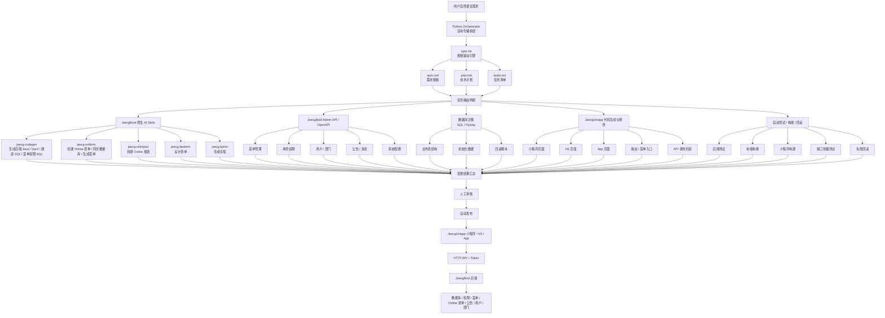

```mermaid
flowchart TD
  A["用户自然语言需求"] --> B["Python Orchestrator<br/>自动化编排层"]

  B --> C["spec-kit<br/>规格驱动引擎"]
  C --> C1["spec.md<br/>需求规格"]
  C --> C2["plan.md<br/>技术计划"]
  C --> C3["tasks.md<br/>任务清单"]

  C1 --> D["任务路由判断"]
  C2 --> D
  C3 --> D

  D --> E1["JeecgBoot 原生 AI Skills"]
  D --> E2["JeecgBoot Admin API / OpenAPI"]
  D --> E3["数据库迁移<br/>SQL / Flyway"]
  D --> E4["JeecgUniapp 代码生成与修改"]
  D --> E5["自动测试 / 构建 / 回滚"]

  E1 --> F1["jeecg-codegen<br/>生成后端 Java / Vue3 / 建表 SQL / 菜单权限 SQL"]
  E1 --> F2["jeecg-onlform<br/>创建 Online 表单 / 同步数据库 / 生成菜单"]
  E1 --> F3["jeecg-onlreport<br/>创建 Online 报表"]
  E1 --> F4["jeecg-desform<br/>设计表单"]
  E1 --> F5["jeecg-bpmn<br/>生成流程"]

  E2 --> G1["菜单管理"]
  E2 --> G2["角色权限"]
  E2 --> G3["用户 / 部门"]
  E2 --> G4["公告 / 消息"]
  E2 --> G5["系统配置"]

  E3 --> H1["业务表结构"]
  E3 --> H2["初始化数据"]
  E3 --> H3["回滚脚本"]

  E4 --> I1["小程序页面"]
  E4 --> I2["H5 页面"]
  E4 --> I3["App 页面"]
  E4 --> I4["路由 / 菜单入口"]
  E4 --> I5["API 调用封装"]

  E5 --> J1["后端测试"]
  E5 --> J2["前端构建"]
  E5 --> J3["小程序构建"]
  E5 --> J4["接口冒烟测试"]
  E5 --> J5["失败回滚"]

  F1 --> K["变更结果汇总"]
  F2 --> K
  F3 --> K
  F4 --> K
  F5 --> K
  G1 --> K
  G2 --> K
  G3 --> K
  G4 --> K
  G5 --> K
  H1 --> K
  H2 --> K
  H3 --> K
  I1 --> K
  I2 --> K
  I3 --> K
  I4 --> K
  I5 --> K
  J1 --> K
  J2 --> K
  J3 --> K
  J4 --> K
  J5 --> K

  K --> L["人工审核"]
  L --> M["自动发布"]

  M --> N["JeecgUniapp 小程序 / H5 / App"]
  N --> O["HTTP API + Token"]
  O --> P["JeecgBoot 后端"]
  P --> Q["数据库 / 权限 / 菜单 / Online 表单 / 公告 / 用户 / 部门"]
```